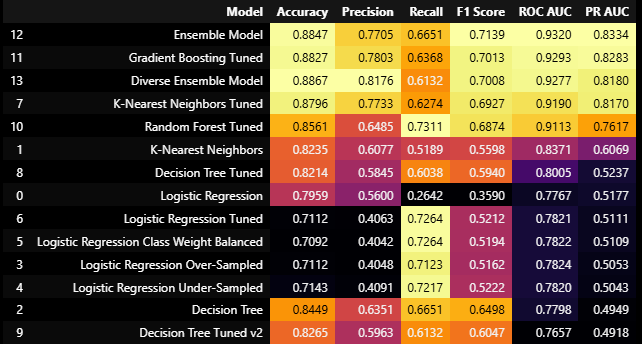

Classification Portuguese Wines 

## Classification of the Quality of Portuguese White Wines 

Toolset: Logistic Regression & KNN & Decision Tree comparison  
with hyperparameters  
with over/under-sampling  
*after middle conclusion:* RandomForest, Boosting & Ensemles

## Table of Contents

### Introduction: Data set Overview
The dataset that's we see here contains 12 columns and 4898 entries of data about Portuguese white wines.

 **Properties:**
    
* **fixed acidity**  
* **volatile acidity**  
* **citric acid**  
* **residual sugar**  
* **chlorides**  
* **free sulfur dioxide**  
* **total sulfur dioxide**  
* **density**  
* **pH**  
* **sulphates**  
* **alcohol**  
* **quality** 

### Questions:
    
Predict which wines are 'Good/1' and 'Not Good/0' (binary classification; check balance of classes; save predictions to .csv)

[Part 1: Import, Load Data](Classification_Portuguese_Wines.ipynb##Middle-conclusion)

[Part 2: Exploratory Data Analysis](Classification_Portuguese_Wines.ipynb##Middle-conclusion)

[Part 3: Data Wrangling and Transformation](Classification_Portuguese_Wines.ipynb##Middle-conclusion)  

[Part 4: Machine Learning](Classification_Portuguese_Wines.ipynb##Middle-conclusion)

[Middle Conclusion](Classification_Portuguese_Wines.ipynb##Middle-conclusion)

[Final Conclusion](Classification_Portuguese_Wines.ipynb##The-Final)

#### The final  
**The final Ensemble** model proves to be the most robust solution, effectively leveraging the complementary strengths of Gradient Boosting and KNN. 
It *achieves the highest* overall PR-AUC score (~0.833) and F1-score (~0.714), providing the best trade-off between identifying good wines (Recall) and minimizing false positives (Precision).  
The confusion matrix confirms it correctly identifies a significant portion of the minority class while maintaining high accuracy on the majority class.    
This demonstrates the power of ensemble methods in leveraging diverse model predictions to improve overall robustness and accuracy.  
The final model is ready for deployment, with the Voting Classifier being the recommended choice due to its balanced and strong performance across key metrics for our imbalanced classification task.

However, while the **Ensemble** offers peak performance, the **tuned KNN** model remains a compelling alternative due to its simplicity, lower training costs, and ease of deployment.
In contrast, the **Ensemble model**, though more performant, requires maintaining multiple models, more memory, and longer inference times. 

**The final choice** between these models should weigh the marginal performance gains of the Ensemble against  
the increased complexity, training time, and economic costs associated with implementing and maintaining such a sophisticated system.

------------------------------------------------

#### Future steps:   
deploy with **SHAP** for interpretability, monitor drift on new vintages, or incorporate external factors like _region_ for enhanced accuracy.  
Compare feature importances – if alcohol, volatile-acidity, sulphates are on top we confirm wine-expert knowledge.  
re-check calibration plot – business may prefer a well-calibrated prob-0.7 over a 0.9 that is wrong half the time.  
Probability threshold 0.5 can be moved later to favour precision or recall depending on business cost.  
GB usually beats RF on tabular data, but watch for over-fit; use **validation_fraction** early-stop

------------------------------------------------

#### If I find data about Georgian wines I could taste it by myself!)